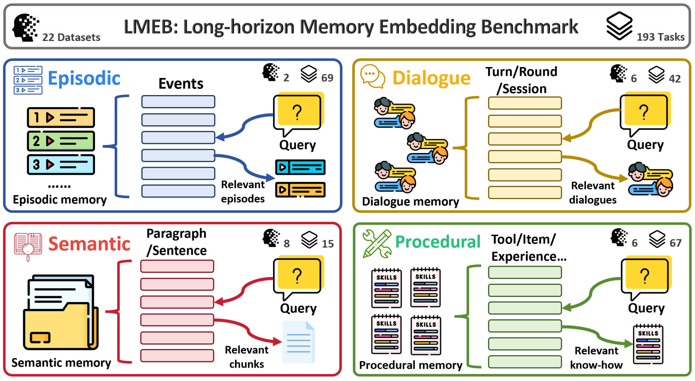
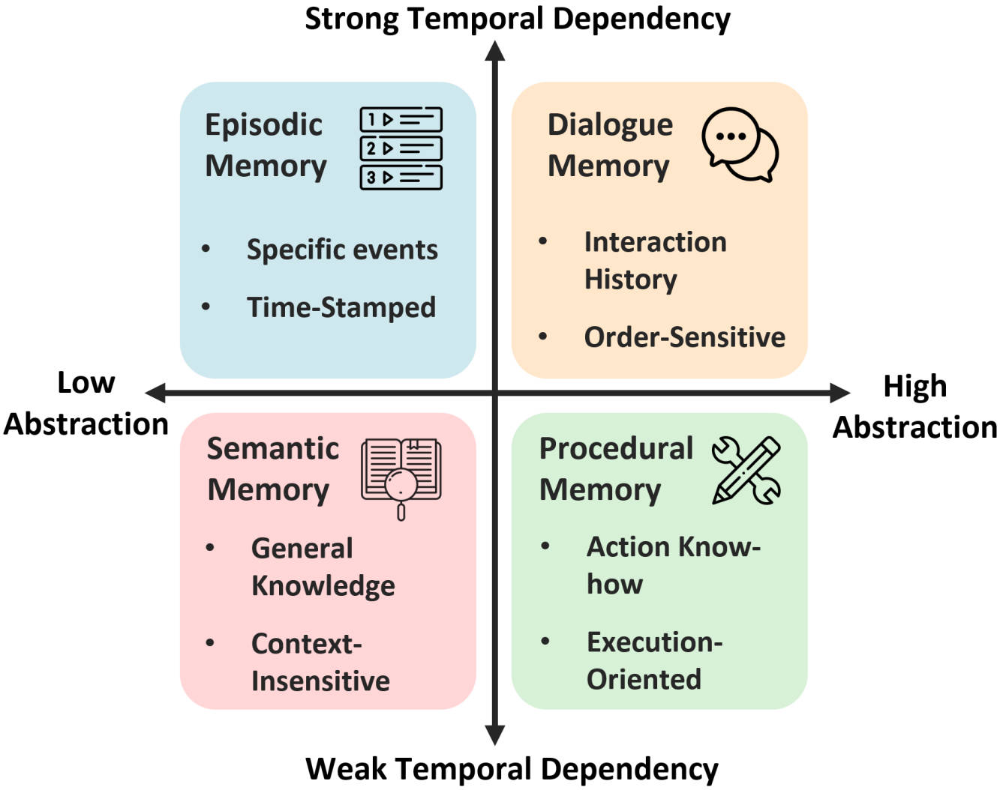
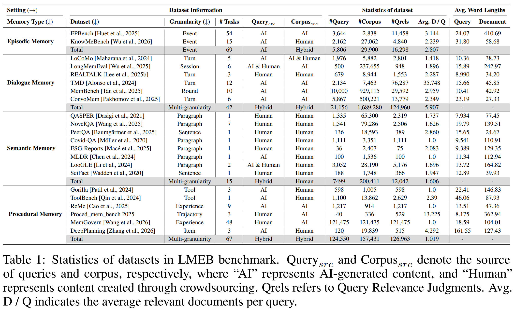
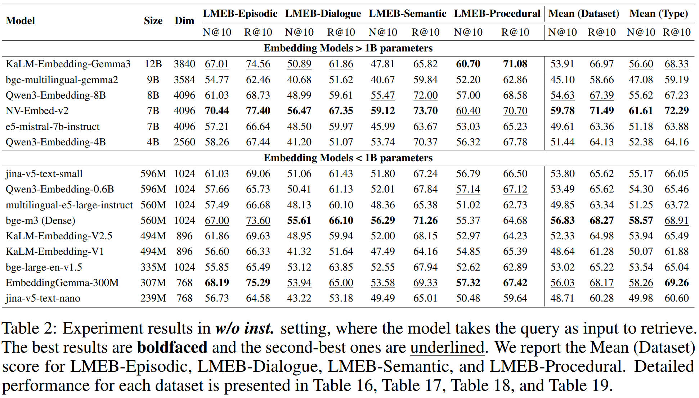
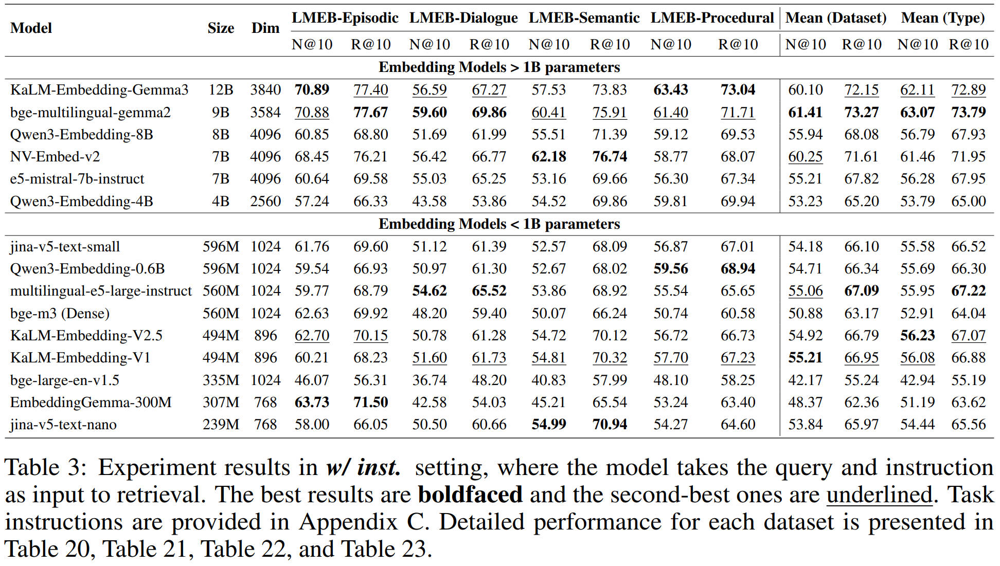
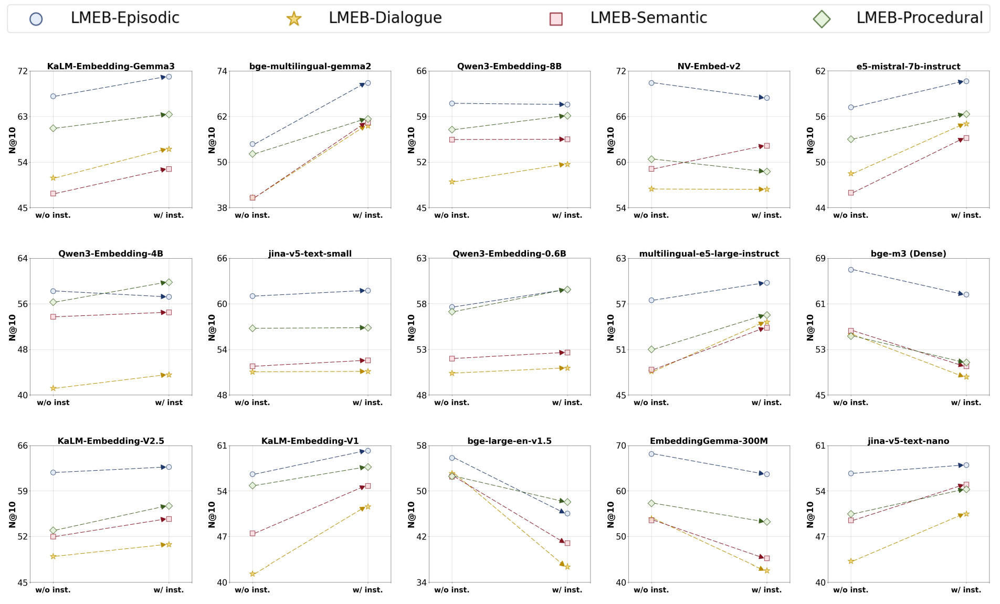
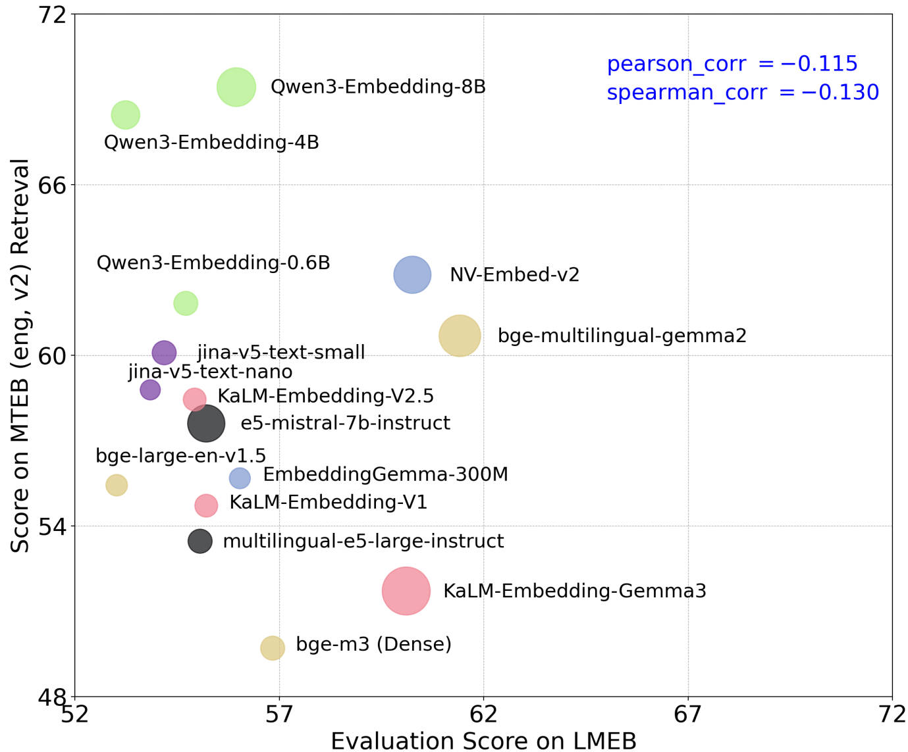

# 🌟LMEB: Long-horizon Memory Embedding Benchmark

<p align="center">
  <a href="https://huggingface.co/datasets/KaLM-Embedding/LMEB">
    
  </a>
  <a href="https://huggingface.co/papers/2603.12572">
    
  </a>
  <a href="https://github.com/KaLM-Embedding/LMEB">
    
  </a>
  <a href="https://arxiv.org/abs/2603.12572v1">
    
  </a>
   <a href="https://kalm-embedding.github.io/LMEB.github.io/">
    
  </a>
  <a href="https://github.com/KaLM-Embedding/LMEB/pulls">
    
  </a>
</p>

## 🔥 Why LMEB?

LMEB fills a crucial gap in current embedding benchmarks, offering a standardized and reproducible evaluation that focuses on **long-term memory retrieval**. By evaluating the memory retrieval capabilities of embedding models, **a crucial ability for memory-augmented systems like OpenClaw🦞**, LMEB helps OpenClaw 🦞 identify the most suitable embedding models, **enhancing its ability to adapt, remember, and make personalized, user-aware decisions.**

## Introduction

Welcome to the **Long-horizon Memory Embedding Benchmark (LMEB)**! Unlike existing text embedding benchmarks that narrowly focus on passage retrieval, LLMEB is designed to evaluate embedding models' ability to handle **complex, long-horizon memory retrieval tasks**, focusing on fragmented, context-dependent, and temporally distant information. LMEB spans **22 diverse datasets** and **193 retrieval tasks**, across **4 memory types**:

- 📅 **Episodic Memory** involves the retrieval of past events linked to temporal cues, entities, contents, and spatial contexts. The ability to effectively retrieve and utilize episodic memories is critical for enhancing adaptability, decision-making, and temporal
reasoning in complex, real-world tasks.
- 💬 **Dialogue Memory**:  focuses on maintaining context across multi-turn interactions, enabling systems to recall previous dialogue turns and user preferences. This facilitates coherent conversations and improves the system’s ability to adapt and provide personalized responses over time. 
- 📚 **Semantic Memory**:  involves recalling general knowledge and facts about the world, independent of time or specific context. Unlike episodic memory, semantic memory is stable, generalizable, and not tied to specific events. It forms the foundation for memory-augmented reasoning and adaptive knowledge utilization.
- 🔧 **Procedural Memory**: supports the retrieval of learned skills and action sequences, which are essential for tasks that require problem-solving and multi-step reasoning. It is critical for automating and generalizing task-oriented experiences, especially in agentic systems and reinforcement learning systems.

<p align="center">
  
  
</p>

## Enviroment
```bash
conda create -n lmeb python==3.10
conda activate lmeb
pip install -r requirements.txt
```
Note: If you want to evaluate the NV-Embed-v2 model, install the dependencies from requirements_nv.txt instead, as NV-Embed-v2 relies on transformers==4.42.4:
```bash
pip install -r requirements_nv.txt
```

## Data
The LMEB benchmark dataset is required to run the evaluation. Download the dataset to the `eval_data` directory using the following command:
```bash
huggingface-cli download --repo-type dataset --resume-download KaLM-Embedding/LMEB --local-dir ./eval_data
```

## Evaluation
Run LMEB evaluation using BM25
```bash
bash ./scripts/run_bm25.sh
```
Run LMEB evaluation WITH task-specific instructions (w_inst = with instruction)
```bash
bash ./scripts/run_lmeb_w_inst.sh
```
Run LMEB evaluation WITHOUT task-specific instructions (wo_inst = without instruction)
```bash
bash ./scripts/run_lmeb_wo_inst.sh
```

- **model_path**: Path to the embedding model weights directory (e.g., "./models/KaLM_Embedding_V2.5"). This specifies where the pre-trained model files are stored.
- **tasks**: Name of the evaluation task(s) to run (e.g., "LoCoMo"). Multiple tasks can be specified (separated by commas).
- **benchmark**: Name of the benchmark suite to use (fixed as "LMEB" for this evaluation).
- **batch_size**: Batch size for model inference (e.g., 512). Controls the number of samples processed per iteration, balancing speed and memory usage.
- **output_dir**: Directory path to save evaluation results (e.g., "lmeb_results/").
- **precision**: Precision mode for model inference (e.g., "fp16"). Common values include "fp32" (full precision) and "fp16" (half precision, faster and memory-efficient).
- **model_kwargs**: JSON-formatted keyword arguments passed to the model initialization. Key sub-parameters include:
  - `trust_remote_code`: Whether to trust and execute remote code (set to `true` for custom models).
  - `attn_implementation`: Attention implementation method (e.g., "sdpa" for Scaled Dot-Product Attention).
  - `max_length`: Maximum input sequence length (e.g., 1024), limiting the number of tokens processed per sample.
  - `do_norm`: Whether to normalize the embedding vectors (set to `true` for better retrieval performance).
  - `use_instruction`: Whether to use task-specific instructions during encoding (set to `true` to enable instruction following).
  - `instruction_dict_path`: Path to the JSON file containing task instructions (e.g., "task_instructions.json").
  - `pooler_type`: Pooling method for generating sentence embeddings (e.g., "mean" for mean pooling).
  - `attn_type`: Attention type used in embedding (e.g., "biattn" for bidirectional attention).
  - `instruction_template`: Template for formatting instructions (e.g., "Instruct: {}\nQuery:" where `{}` is replaced with task-specific instructions).
- **encode_kwargs**: JSON-formatted keyword arguments passed to the embedding encoding process. Key sub-parameters include:
  - `normalize_embeddings`: Whether to normalize the final embeddings (consistent with `do_norm` for alignment).
  - `show_progress_bar`: Whether to display a progress bar during encoding (set to `true` for real-time progress tracking).

## Summarization
```bash
bash summary.sh
```
- **embedding_model_name**: A variable specifying the unique identifier of the embedding model (e.g., "local__KaLM_Embedding_V2.5"). It is used to locate the model's evaluation result directory under ./lmeb_results/.
- **1st argument**:: Path to the directory storing evaluation results (e.g., "./lmeb_results/local__KaLM_Embedding_V2.5/wo_inst"). 
- **2nd argument**: Name of the benchmark suite to summarize (e.g., "LMEB"). 
- **3rd argument (optional)**: Specific metric name to summarize (e.g., "R_cap_at_10"). ndcg@10 by default.

## Statistics of LMEB

<p align="center">
  
</p>

## Main Results

- **LMEB Benchmark Offers a Reasonable Level of Difficulty**
- **Larger Embedding Models Do Not Always Perform Better**
- **The Impact of Task Instructions on Model Performance Varies**


<p align="center">
  
</p>

<p align="center">
  
</p>

<p align="center">
  
</p>

## Correlation Analysis

- **LMEB and MTEB Exhibit Orthogonality in Evaluation Capacities**: The correlation analysis between LMEB and MTEB (eng, v2) (retrieval subset) shows low Pearson and Spearman
correlation coefficients of **-0.115** and **-0.130**, respectively, demonstrating that the two benchmarks are
orthogonal in the domains they evaluate. While MTEB mainly focuses on traditional passage retrieval,
LMEB is tailored to evaluate long-horizon memory retrieval, which requires handling fragmented,
context-dependent, and temporally distant information. This orthogonality emphasizes the unique
value of LMEB in assessing long-term memory retrieval capabilities, making it a crucial benchmark
for evaluating embedding models in complex, real-world, memory-intensive scenarios.

<p align="center">
  
</p>

## Acknowledgement
We sincerely thank the MTEB (Massive Text Embedding Benchmark) project (https://github.com/embeddings-benchmark/mteb) and all its contributors and maintainers for providing the standardized evaluation framework for embedding models.

## Citation
If you find this benchmark useful, please consider giving a star and citation.
```
@misc{zhao2026lmeb,
      title={LMEB: Long-horizon Memory Embedding Benchmark}, 
      author={Xinping Zhao and Xinshuo Hu and Jiaxin Xu and Danyu Tang and Xin Zhang and Mengjia Zhou and Yan Zhong and Yao Zhou and Zifei Shan and Meishan Zhang and Baotian Hu and Min Zhang},
      year={2026},
      eprint={2603.12572},
      archivePrefix={arXiv},
      primaryClass={cs.CL},
      url={https://arxiv.org/abs/2603.12572}, 
}
```


## Contact
If you encounter any issue, feel free to contact us via the email: <zhaoxinping@stu.hit.edu.cn> or <xinpingzhao@slai.edu.cn>
